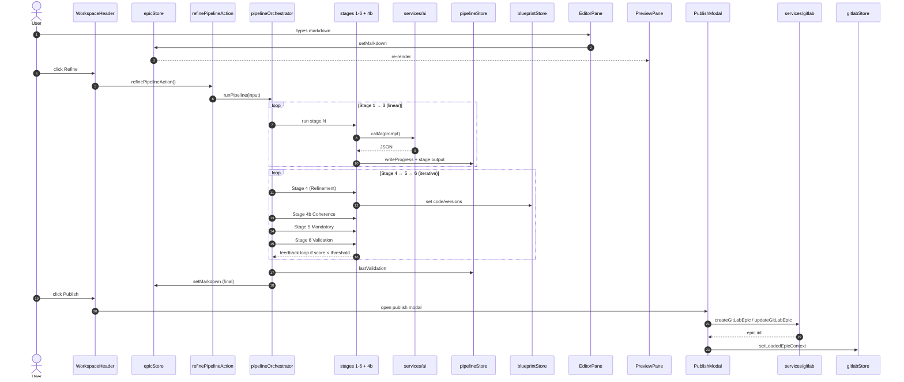
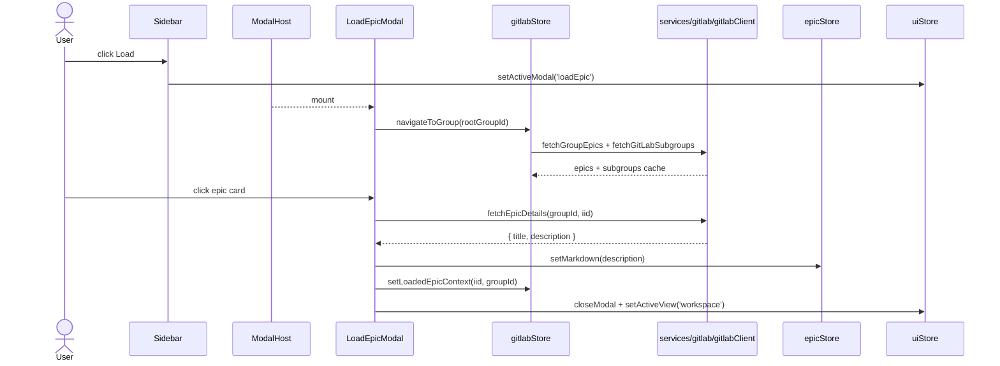
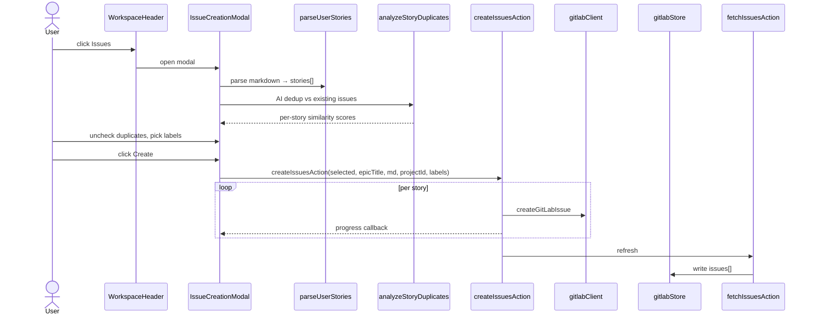
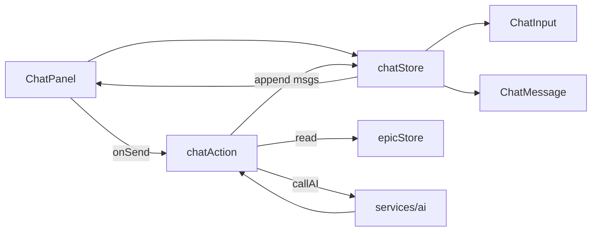
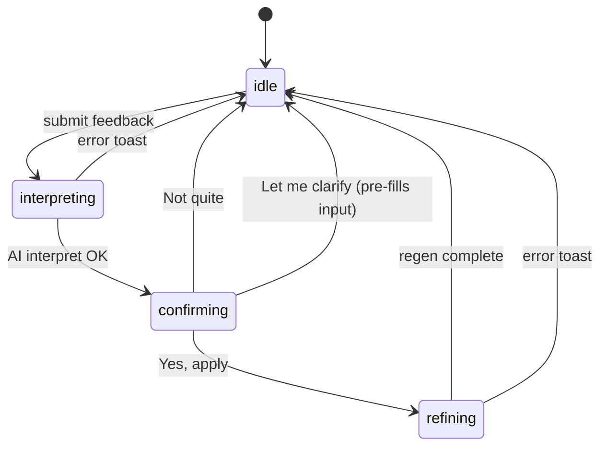
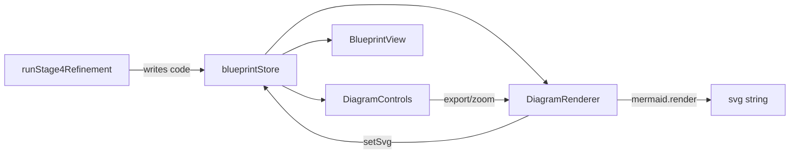
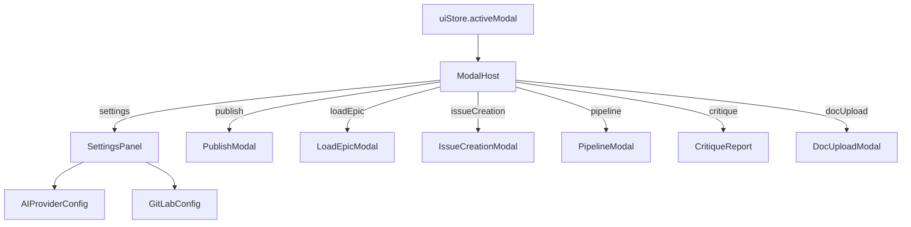
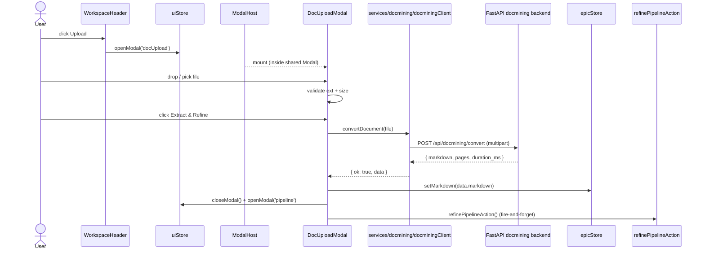

# FRAME v5 — System Map

> Cross-cutting view of how the pieces fit together. Per-file docs describe *what* each module is; this doc describes *how they talk*.
>
> The unifying axis is **Zustand stores**. UI components read stores; actions/services write to stores; stores never call each other directly — cross-store work happens in actions.

---

## 1. Module layers

```mermaid
flowchart LR
    subgraph UI["UI layer (components/, App, main)"]
        A1[Editor / Preview]
        A2[WorkspaceHeader]
        A3[Modals / Panels]
        A4[IssueManagerView]
        A5[BlueprintView]
        A6[ChatPanel]
    end

    subgraph Stores["State (stores/*)"]
        S1[epicStore]
        S2[pipelineStore]
        S3[configStore]
        S4[uiStore]
        S5[blueprintStore]
        S6[chatStore]
        S7[gitlabStore]
        S8[issueStore]
    end

    subgraph Actions["Actions (actions/, chat/, pipeline/refinePipelineAction)"]
        X1[refinePipelineAction]
        X2[regenerateBlueprintAction]
        X3[createIssuesAction]
        X4[fetchIssuesAction]
        X5[chatAction]
    end

    subgraph Pipeline["Pipeline (pipeline/)"]
        P1[pipelineOrchestrator]
        P2[stages 1..6 + 4b]
        P3[prompts/]
        P4[epicScorer]
    end

    subgraph Services["Services (services/*)"]
        V1[ai/aiClient]
        V2[ai/azureClient + openaiClient]
        V3[gitlab/gitlabClient]
        V4[templates/templateLoader]
    end

    subgraph Domain["Domain (domain/, theme/)"]
        D1[types]
        D2[epicSerializer]
        D3[sectionDiscovery]
        D4[complexity]
        D5[categoryConstants]
        D6[theme/tokens]
    end

    UI -->|read / write| Stores
    UI -->|invoke| Actions
    Actions -->|write| Stores
    Actions --> Pipeline
    Actions --> Services
    Pipeline --> Services
    Pipeline --> Domain
    Services --> Domain
    Stores -.depends on.-> Domain
```

---

## 2. Store ownership

Each store owns one slice of app state. Keep this list tight — new state usually belongs in an existing store.

| Store | Owns | Primary writers |
|---|---|---|
| `epicStore` | Raw markdown, parsed `EpicDocument`, category, SLA, complexity, template outline | `EditorPane`, `WorkspaceHeader`, `LoadEpicModal`, `refinePipelineAction` |
| `pipelineStore` | Current stage, isRunning, per-stage outputs, `lastValidation`, error | `pipelineOrchestrator` (via `refinePipelineAction`) |
| `blueprintStore` | Mermaid source (`code`), rendered SVG, zoom, fullscreen, versions, D1/D2 refinement state | `runStage4Refinement` (indirectly), `DiagramRenderer`, `regenerateBlueprintAction` |
| `chatStore` | Chat messages, input string, isProcessing | `ChatPanel`, `chatAction` |
| `configStore` | AI provider config, GitLab config, endpoints, localStorage persistence | `SettingsPanel` family, `main.tsx` (hydrate) |
| `uiStore` | `activeView`, `activeTab`, `activeModal`, `issueSubTab`, toasts, split-pane width | Any component that navigates or opens a modal |
| `gitlabStore` | Cached GitLab browse tree, search results, `loadedEpicIid/groupId`, issues, publish level | `LoadEpicModal`, `PublishModal`, `fetchIssuesAction`, `IssueManagerView` |
| `issueStore` | Local-only issue draft state (pre-publish) | `IssueCreationModal` workflow |

---

## 3. Core data flow — "Rough idea → Published epic"

This is the dominant happy path. Steps reference file docs.

**Key invariants:**
- Orchestrator is pure — all store writes go through `refinePipelineAction` (see `pipeline/pipelineOrchestrator.md`).
- Stage 4 writes the diagram into `blueprintStore` **as it generates**, so the blueprint tab can render mid-pipeline.
- `pipelineStore.lastValidation` drives the Critique modal; `epicStore` drives Editor/Preview.

---

## 4. GitLab load flow — "Pick an epic from GitLab"

After this, the user's editor contains the GitLab epic body and Publish becomes an **Update** rather than a Create (detected via `gitlabStore.loadedEpicIid !== null`).

---

## 5. Issue creation flow — "Epic → child issues"

Additional branch: **Custom Issue** composer → `generateCustomStories(aiConfig, prompt, epicMd, existingStories, existingIssues)` appends synthetic stories (`id: custom-*`) before dedup.

---

## 6. Chat flow

- Quick-action buttons ("Expand", "Add examples", "Simplify") are just pre-canned prompts handed to `chatAction`.
- `chatAction` reads the current epic markdown from `epicStore.getState()` and includes it as context on every message.

---

## 7. Diagram refinement flow (D1/D2)

- `interpretDiagramFeedback` returns `{ interpretation, changeItems, confidence }`.
- The user confirms; `regenerateBlueprintAction(changeItems.join('. '))` does the actual regenerate.
- Versions push onto `blueprintStore.versions` with labels; the user can revert via history pills.
- `BlueprintView.handleEmbedDiagram` calls `epicStore.replaceArchitectureSection(code)` — **this is the only writer** of the diagram back into the epic body.

---

## 8. Mermaid rendering — single initialization

There is exactly one `mermaid.initialize(...)` call in the app: `src/components/blueprint/DiagramRenderer.tsx`.

`PreviewPane` renders secondary diagrams from the markdown body using `mermaid.render` **without** calling `initialize` — it inherits the single global config set by `DiagramRenderer`.

---

## 9. Modals — `uiStore.activeModal` fan-out

Only one modal is mounted at a time. `pipeline` modal has `preventClose` while running; `critique` and others are freely dismissable.

---

## 9b. DocMining upload flow — "File → populated editor → auto-refine"

- The Vite proxy rewrites `/api/docmining` → `${VITE_DOCMINING_BASE_URL || http://localhost:8000}/api/v1/documents` (see `vite.config.ts`).
- **Production requires same-origin reverse proxy or backend CORS — the Vite proxy is dev-only.** See `docs/knowledge/services/docmining/docminingClient.md#deployment-important`.
- Backend enforces `workers=1` (Docling PDF backends are not thread-safe; upstream #1191).
- Errors surface inline in the modal — no toast until the pipeline stage raises one.
- `DocUploadModal` uses an `AbortController` + unmount guard: closing the modal mid-upload aborts the fetch and prevents the resolved promise from mutating the store or firing the pipeline.

---

## 10. Endpoint routing (AI + GitLab)

The config reader (`configStore.config`) exposes three buckets; clients resolve endpoints in this order:

- **AI**: `config.endpoints.azureEndpoint` is the **canonical** Azure URL source; `aiClient.callAI` builds the final URL from `{ endpoints.azureEndpoint, azure.apiVersion, azure.deploymentName }`. The `config.ai.azure.endpoint` field is legacy and should not be used.
- **GitLab**: `config.gitlab.{baseUrl, accessToken, authMode, rootGroupId}`; every client function in `services/gitlab/gitlabClient.ts` accepts the whole `GitLabConfig` object and composes the URL itself — no globals.

(See memory note `feedback_azure_endpoint_bug` for the historical bug that drove this convention.)

---

## 11. Theme & visual system

- `theme/tokens.ts` defines CSS custom properties (`--col-background-brand` = UBS red, `--col-text-primary`, `--input-background`, etc.) injected at root.
- Components reference `var(--col-*)` rather than literal hex where possible — exceptions are the Paul Tol Light palette passed into `mermaid.initialize` (which cannot read CSS vars) and explicit UBS red literals (`#E60000` / `#CC0000`).
- Font stack `F = "Frutiger, 'Helvetica Neue', Helvetica, Arial, sans-serif"` is duplicated as a local const in most components — kept local so each component is self-contained.

---

## 12. Error containment

- **Per-view**: `ErrorBoundary` wraps each `ViewRouter` branch — one tab can't crash the shell.
- **Per-fetch**: every GitLab call returns `{ success, data?, error? }` rather than throwing; UI surfaces failures via `uiStore.addToast`.
- **Per-pipeline**: stage failures set `pipelineStore.error`; orchestrator continues to emit progress so the modal can show where it stopped.
- **Per-render**: `DiagramRenderer` catches mermaid parse errors and writes them to `blueprintStore.error` + renders an inline error panel.

---

## 13. Test scaffolding

- `src/test/setup.ts` — Vitest setup (jsdom, CSS mocks).
- `src/test/helpers.ts` — shared render helpers and store resets.
- Store tests colocated as `*.test.ts`; pipeline stages tested via `pipeline/stages/*.test.ts`; components via `*.test.tsx`.

---

## 14. File map — quick index

- **Bootstrap**: `main.tsx`, `App.tsx`.
- **Layout**: `components/layout/*`.
- **Editor + Preview**: `components/editor/*`.
- **Modals**: `components/{settings,gitlab,pipeline,critique,issues}/*Modal.tsx`, `layout/ModalHost.tsx`.
- **Blueprint**: `components/blueprint/*`.
- **Chat**: `components/chat/*` + `chat/chatAction.ts`.
- **Pipeline**: `pipeline/pipelineOrchestrator.ts`, `pipeline/stages/*`, `pipeline/prompts/*`, `pipeline/epicScorer.ts`, `pipeline/refinePipelineAction.ts`.
- **Actions**: `actions/*`.
- **Services**: `services/ai/*`, `services/gitlab/*`, `services/templates/*`.
- **Stores**: `stores/*`.
- **Domain**: `domain/*`, `theme/tokens.ts`.

See [`README.md`](./README.md) for the concise index.
