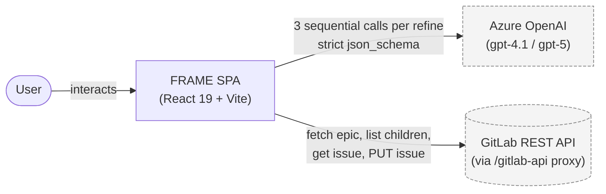
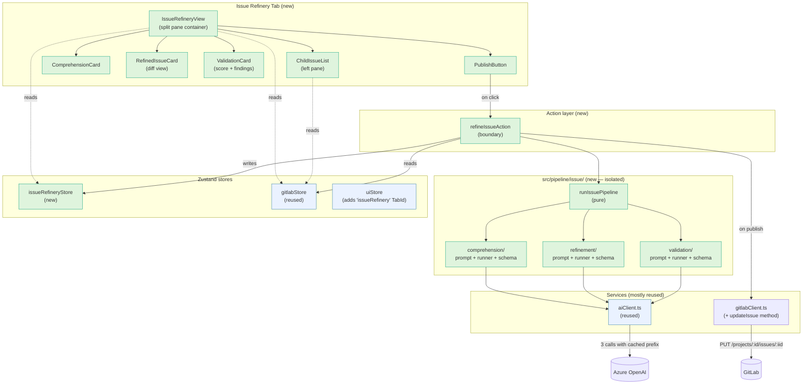
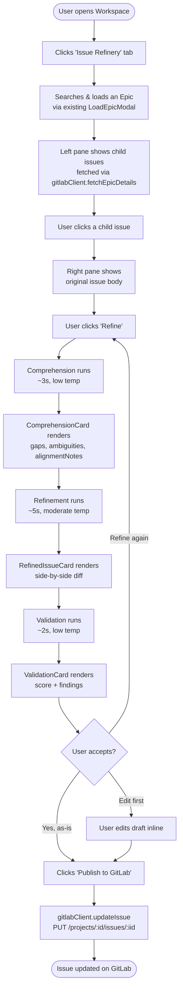
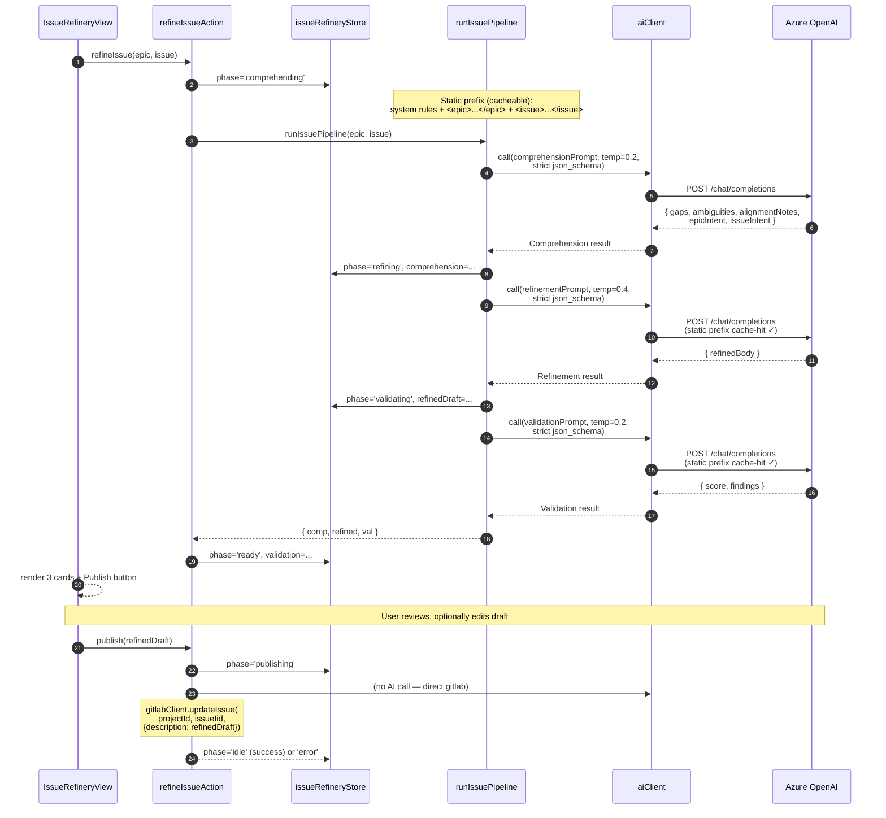
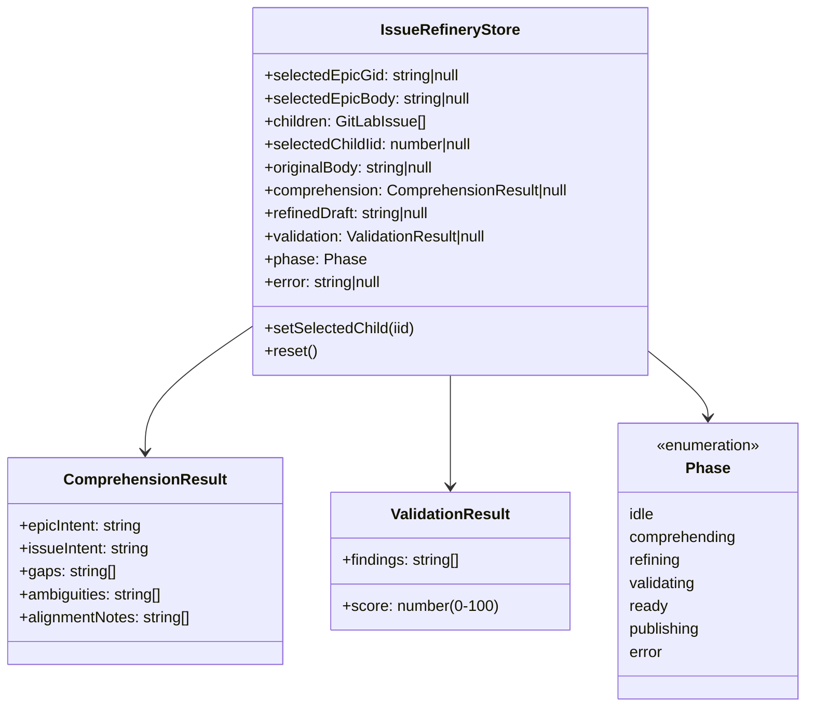
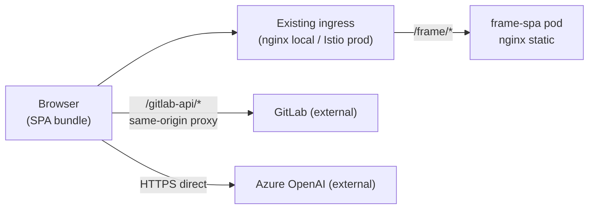

# Issue Refinery — High-Level Design (HLD)

**Date**: 2026-05-18
**Author**: FRAME team
**Status**: HLD locked, detailed design in [2026-05-18-issue-refinery-design.md](./2026-05-18-issue-refinery-design.md)
**Companion docs**:
- Implementation plan: [2026-05-18-issue-refinery-implementation-plan.md](./2026-05-18-issue-refinery-implementation-plan.md)
- Taskmaster PRD: [.taskmaster/docs/issue-refinery-prd.txt](../../.taskmaster/docs/issue-refinery-prd.txt)

---

## 1. One-paragraph summary

Issue Refinery is a new top-level FRAME tab that operates at the **child-issue level** of the GitLab hierarchy, complementing the existing epic-level Requirement Design tab. The user loads an epic, picks one of its child issues, and runs a focused 3-stage AI pipeline (Comprehension → Refinement → Validation) that rewrites the issue body grounded in the parent epic's intent. The refined draft is staged as a diff; an explicit "Publish to GitLab" button writes it back via `PUT /projects/:id/issues/:iid`. The feature reuses the existing GitLab data layer and Azure OpenAI client wholesale, adds one new gitlab method, and runs entirely client-side. No backend changes; no edits to the existing epic pipeline; coexists with the existing `issues` tab without merging.

---

## 2. System context

**Boundaries:**
- All AI inference runs against existing Azure OpenAI deployments (no new model deployments).
- All GitLab traffic flows through the existing Vite proxy (`/gitlab-api`) in dev and the existing same-origin ingress in prod.
- **No new backend services**, no DocMining involvement, no Export involvement.

---

## 3. Component view

**Color legend:**
- 🟢 Green = net-new code
- 🔵 Blue = reused, untouched

`gitlabClient.ts` is the only existing file that gains a new method (`updateIssue`); everything else is additive.

---

## 4. User journey

**Latency budget** (rough, gpt-4.1 default): 8-12 s total for the 3 stages, dominated by Refinement.
**Cost note**: stages 2 & 3 hit the prompt cache on the static document block; re-running Refine on the same issue is ~75% cheaper than the first run.

---

## 5. Pipeline sequence (the AI bit)

**Cache discipline:** the bytes of the static prefix must be **identical** across the three calls. Any interpolated timestamp, request ID, or stray whitespace busts the cache. A dev-only HUD will log `usage.prompt_tokens_details.cached_tokens` per call to verify.

**Retry policy:** on JSON schema validation failure, one retry per stage using the Instructor pattern (append the validation error to messages, re-call). Beyond that, the stage fails and `phase='error'` with details surfaced in the UI.

---

## 6. Data model (HLD-level)

---

## 7. Deployment view (no change)

**Net-new infra: zero.** The feature is purely client-side; the existing `frame-spa` deployment serves it; existing proxies route GitLab traffic; Azure OpenAI calls go direct from browser using configured credentials in [configStore.ts](../../src/stores/configStore.ts).

---

## 8. Key non-functional properties

| Property | Target | Notes |
|---|---|---|
| Refinement latency (P50) | ≤ 10 s end-to-end | 3 sequential calls, sandwich-cached prefix |
| Cost per refinement (P50) | ≤ $0.02 | gpt-4.1 default; ~$0.005 on re-runs due to cache |
| Schema compliance | 100% strict (single retry on failure) | json_schema strict mode |
| Failure isolation | Per-stage; partial state never committed | Zod validate before store write |
| Coexistence with existing pipeline | Zero shared state | Separate store, separate pipeline dir |
| Scope-guard compliance | 100% | No edits to welcome/, pipeline/orchestrator*, pipeline/stages/** |
| GitLab write safety | Idempotent PUT; always-overwrite per locked decision | No concurrency check in v1 |

---

## 9. Scope boundaries

**In scope (v1):**
- New tab + view; epic picker (reusing existing modal); child issue list; 3-stage pipeline; diff UI; advisory validation; stage-and-publish PUT.

**Out of scope (v1, may be future work):**
- Refining tasks/subtasks nested under issues.
- Optimistic concurrency / merge-conflict UX on publish.
- Iterative refinement loop (Validation → Refinement feedback).
- Category templates for issues (bug / feature / spike).
- Batch refinement (refining multiple issues at once).
- Refining issues that don't belong to an epic (orphan issues).
- Streaming partial results to the UI.
- New backend services or stages.

---

## 10. Risks & mitigations (HLD-level)

| Risk | Mitigation |
|---|---|
| Prompt cache busts silently → cost explodes | Dev-only HUD logs `cached_tokens` per call; CI assertion would be excessive but a single dev verification gate per PR is added |
| Always-overwrite on publish clobbers a teammate's edit | Documented decision; v2 may add optimistic concurrency |
| Schema-strict mode unsupported by some Azure deployments | Existing `aiClient.ts` already handles fallback; we'll reuse its retry path |
| Coupling drift: someone calls epic-pipeline functions from issue pipeline | Scope-guard hook + lint rule restricting `src/pipeline/issue/` imports from `src/pipeline/stages/` |
| Tab proliferation / sidebar clutter | Limit to one new tab; explicit naming "Issue Refinery" disambiguates from "Issues" |
| GitLab pagination silently truncates child list | Always request `per_page=100`, follow Link headers; integration test with mocked paginated response |

---

## 11. Open items (resolved before detailed design)

All resolved via prior alignment turns:

| # | Decision | Resolution |
|---|---|---|
| Q1 | Hierarchy depth | Direct epic→issue only |
| Q2 | Iteration loop | Single pass |
| Q3 | Templates | Freeform, no template |
| Q4 | Validation shape | Score + findings, advisory only |
| Q5 | Concurrency | Always overwrite |
| Q6 | Source quotes in Comprehension | Findings only, no quotes |

---

**Next**: see [2026-05-18-issue-refinery-design.md](./2026-05-18-issue-refinery-design.md) for detailed contracts, schemas, file inventory, and prompt designs.
